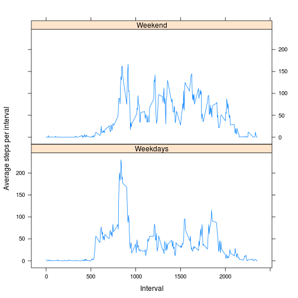

# Reproducible Research: Peer Assessment 1


## Loading and preprocessing the data


I'm assuming that the current working directory has been set to the directory where the
data is -- this could be the top-level directory in the Git repository. I'm first unzipping,
which produces a .csv file, and then reading the csv file. I also print the summary to show
that the data has actually been read and to give an idea of what it's like.


```r
unzip('activity.zip')
data <- read.csv('activity.csv')
summary(data)
```

```
##      steps               date          interval   
##  Min.   :  0.0   2012-10-01:  288   Min.   :   0  
##  1st Qu.:  0.0   2012-10-02:  288   1st Qu.: 589  
##  Median :  0.0   2012-10-03:  288   Median :1178  
##  Mean   : 37.4   2012-10-04:  288   Mean   :1178  
##  3rd Qu.: 12.0   2012-10-05:  288   3rd Qu.:1766  
##  Max.   :806.0   2012-10-06:  288   Max.   :2355  
##  NA's   :2304    (Other)   :15840
```

### Preprocessing

We will need a dataset that has the days (date) and the total steps for that day, one row per day. I store this in the stepsdata data frame.


```r
totalsteps <- tapply(data$steps, data$date, FUN="sum")
stepsdata <- as.data.frame(cbind(names(totalsteps), totalsteps))
```


## What is mean total number of steps taken per day?

The code here produces a histogram of the mean of the total number of steps taken each day.
Each day has 288 data points, corresponding to one point every 5 minutes.


```r
hist(totalsteps, xlab="Number of steps per day", main = NULL)
```

 

Calculate the mean number of steps per day:


```r
mean(totalsteps, na.rm=TRUE)
```

```
## [1] 10766
```

Calculate the median number of steps per day:


```r
median(totalsteps, na.rm=TRUE)
```

```
## [1] 10765
```


## What is the average daily activity pattern?

Here we plot the average number of steps taken at each time durinng the day. So the first point will be the average number of steps taken from 00:00 to 00:05, the second point the average of steps taken between 00:05 and 00:10, and so on.

First we have to preprocess the data to obtain the data a columns with the x-values (the interval) and a column with the y-values (the average number of step for each interval).


```r
stepsave <- tapply(data$steps, data$interval, FUN="mean", na.rm=TRUE)
intervaloneday <- data$interval[1:288]
```

Now plot it:


```r
plot(intervaloneday, stepsave, type="l", xlab="Time of day", ylab="Average steps taken in 5 min. interval")
```

 

### Which 5-minute interval, on average across all the days in the dataset, contains the maximum number of steps?

First calculate the maximum number of steps, then select that element. The name of the element is the interval:


```r
maxsteps <- max(stepsave)
x <- stepsave[stepsave == maxsteps]
busiestinterval <- names(x)
busiestinterval
```

```
## [1] "835"
```

The busiest interval (the one where on average most steps are taken) is 835. Let's do that a bit nicer:


```r
strlen <- nchar(busiestinterval)
minutes <- substr(busiestinterval, strlen-1, strlen)
hour <- substr(busiestinterval, 1, strlen-2)
nicetime <- paste(hour, minutes, sep=':')
nicetime
```

```
## [1] "8:35"
```

The busiest interval is the 5 minute interval starting at 8:35.


## Imputing missing values

The number of NA values can be calculated by generating a logical vector using the `is.na()` function. The number of NAs can then be counted by summing that logical vector:


```r
sum(is.na(data$steps))
```

```
## [1] 2304
```

With some help from our friends on [the forum](https://class.coursera.org/repdata-004/forum/thread?thread_id=82) and on [stackoverflow.com](http://stackoverflow.com/questions/9322773/how-to-replace-na-with-mean-by-subset-in-r-impute-with-plyr/9322975#9322975), I find the following way to replace the NAs by the average for the corresponding interval:


```r
library(plyr)
# technique to replace NA with mean by subset in R and the impute.mean function 
# described at http://stackoverflow.com/a/9322975/3657371
impute.mean <- function(x) replace(x, is.na(x), mean(x, na.rm = TRUE))

# create a new dataset that is equal to the original dataset, but with the 
# missing data filled in
# original dataset is first three variables of the [activity] dataframe
activity.imputed <- plyr::ddply(data[1:3], .(interval), transform,
                                steps = impute.mean(steps),
                                date = date,
                                interval = interval)

# sort by date and interval
activity.imputed <- activity.imputed[order(activity.imputed$date,
                                           activity.imputed$interval),]

# renumber rownames
row.names(activity.imputed) <- 1:nrow(activity.imputed)
```

Now we're going to plot a histogram of the total number of steps using this imputed data frame.


```r
totalsteps.imputed <- tapply(activity.imputed$steps, activity.imputed$date, FUN="sum")
hist(totalsteps, xlab="Number of steps per day", main = "After imputing missing values")
```

 

Calculate the mean number of steps per day:


```r
mean(totalsteps.imputed)
```

```
## [1] 10766
```

Calculate the median number of steps per day:


```r
median(totalsteps.imputed)
```

```
## [1] 10766
```

Compared to the mean and median that we calculated earlier on, the result is not identical, but only marginally different (only the median differs).

## Are there differences in activity patterns between weekdays and weekends?

First I'm adding a column to the data that says whether a given row falls in a weekend, or not.


```r
weekendDays <- c("Saturday", "Sunday")
isWeekendVector <- weekdays(as.Date(data$date)) %in% weekendDays
weekend <- as.factor(isWeekendVector)
levels(weekend) <- c("Weekdays", "Weekend")
activity.imputed <- cbind(activity.imputed, weekend)
```

Now I have to calculate, as before, the average steps taken in each interval, however, I have to separate out the weekdays and the weekends.


```r
calcmeans <- function(x) tapply(x$steps, x$interval, FUN="mean", na.rm=TRUE)

splitdf <- split(activity.imputed, activity.imputed$weekend)
splitdfmeans <- lapply(splitdf, calcmeans)
```

Now rebuild a dataframe for easy plotting: (I'll be looking forward to reviewing other students' assignments for ways to do this nicely.)


```r
means.weekdays <- splitdfmeans[[1]]
means.weekend <- splitdfmeans[[2]]
factor.weekdays <- factor(rep("Weekdays", length(means.weekdays)),
                          c("Weekdays", "Weekend"))
factor.weekend <- factor(rep("Weekend", length(means.weekend)),
                          c("Weekdays", "Weekend"))
plotdata <- as.data.frame(rbind(cbind(means.weekdays, factor.weekdays),
            cbind(means.weekend, factor.weekend)))
interval <- as.numeric(row.names(plotdata))
plotdata <- cbind(interval, plotdata)
```

```
## Warning: some row.names duplicated:
## 289,290,291,292,293,294,295,296,297,298,299,300,301,302,303,304,305,306,307,308,309,310,311,312,313,314,315,316,317,318,319,320,321,322,323,324,325,326,327,328,329,330,331,332,333,334,335,336,337,338,339,340,341,342,343,344,345,346,347,348,349,350,351,352,353,354,355,356,357,358,359,360,361,362,363,364,365,366,367,368,369,370,371,372,373,374,375,376,377,378,379,380,381,382,383,384,385,386,387,388,389,390,391,392,393,394,395,396,397,398,399,400,401,402,403,404,405,406,407,408,409,410,411,412,413,414,415,416,417,418,419,420,421,422,423,424,425,426,427,428,429,430,431,432,433,434,435,436,437,438,439,440,441,442,443,444,445,446,447,448,449,450,451,452,453,454,455,456,457,458,459,460,461,462,463,464,465,466,467,468,469,470,471,472,473,474,475,476,477,478,479,480,481,482,483,484,485,486,487,488,489,490,491,492,493,494,495,496,497,498,499,500,501,502,503,504,505,506,507,508,509,510,511,512,513,514,515,516,517,518,519,520,521,522,523,524,525,526,527,528,529,530,531,532,533,534,535,536,537,538,539,540,541,542,543,544,545,546,547,548,549,550,551,552,553,554,555,556,557,558,559,560,561,562,563,564,565,566,567,568,569,570,571,572,573,574,575,576
## --> row.names NOT used
```

```r
colnames(plotdata) <- c("interval", "means", "weekend")
```

Turn the weekend column into an appropriate factor:


```r
weekend <- as.factor(plotdata$weekend)
levels(weekend) <- c("Weekdays", "Weekend")
plotdata$weekend <- weekend
```


```r
library(lattice)
xyplot(plotdata$means~plotdata$interval|plotdata$weekend, 
       layout=c(1,2), 
       type="l",
       xlab="Interval",
       ylab="Average steps per interval")
```

 

c
